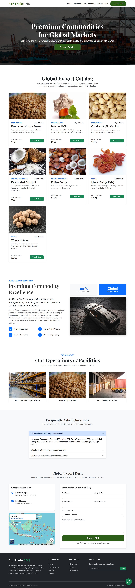
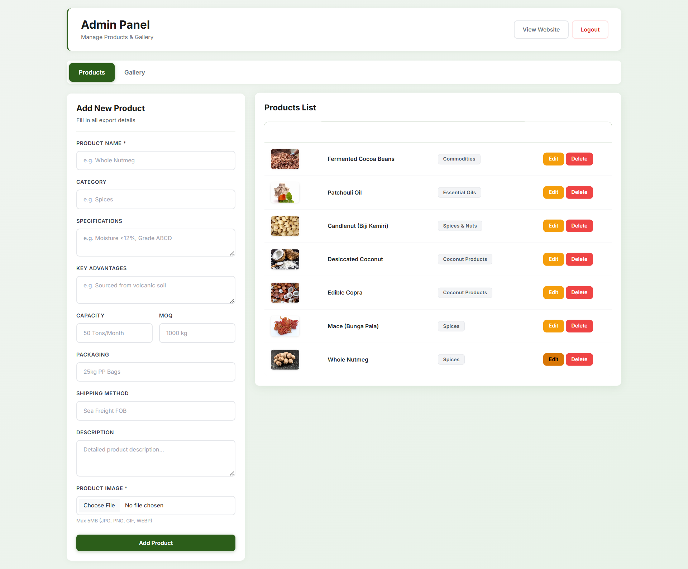
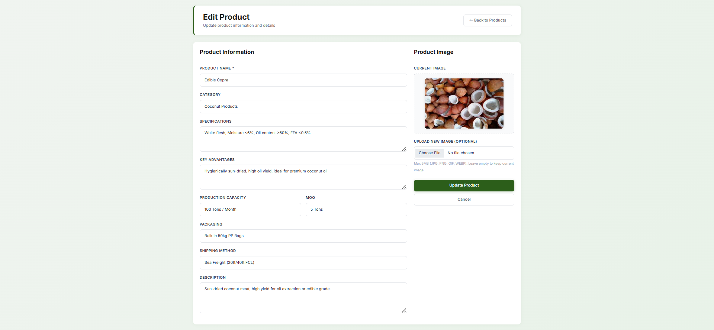
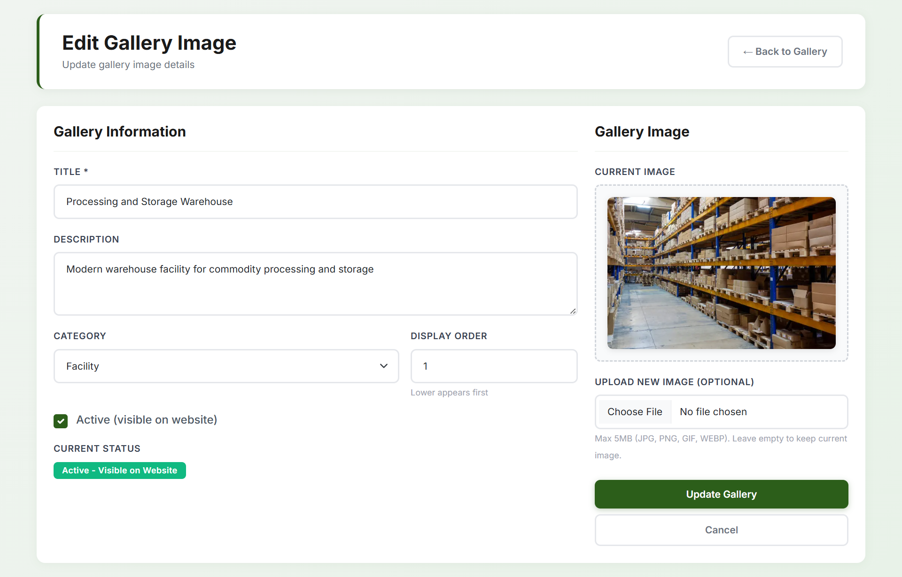
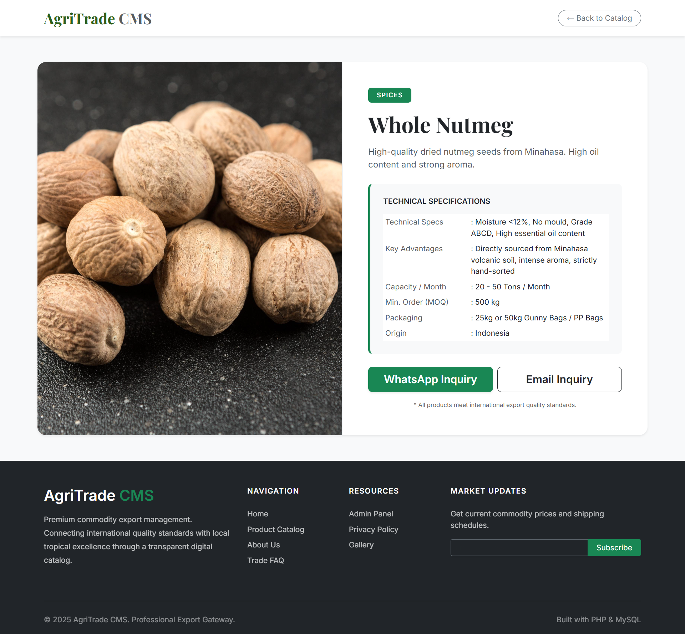
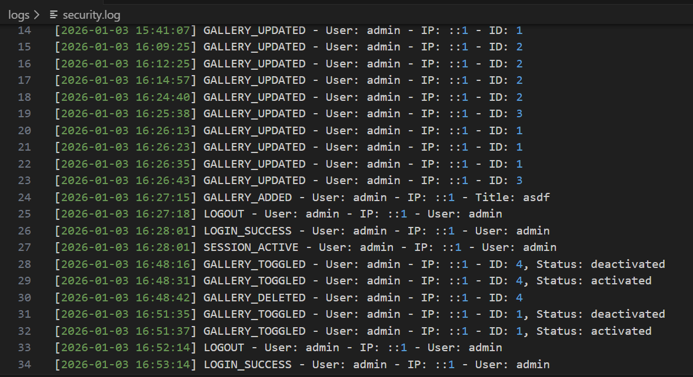

# AgriTrade CMS — Secure-by-Design Web Application

A security-focused Content Management System designed for agricultural export companies, built with a defensive programming mindset and real-world threat considerations.

AgriTrade CMS demonstrates how application security principles can be embedded directly into product design, not added as an afterthought.


---

## Table of Contents

- [Project Purpose](#project-purpose)
- [Security Design Philosophy](#security-design-philosophy)
- [Threat Model Overview](#threat-model-overview)
- [Security Controls Implemented](#security-controls-implemented)
- [Known Security Limitations](#known-security-limitations)
- [Security Roadmap](#security-roadmap)
- [Functional Features](#functional-features)
- [Installation](#installation)
- [Project Structure](#project-structure)
- [Database Design](#database-design)
- [Documentation](#documentation)
- [Author](#author)
- [License](#license)

---

## Project Purpose

This project serves two purposes:

1. Deliver a production-ready CMS for agricultural export businesses
2. Act as a security portfolio project showcasing:
   - Secure coding practices
   - Threat-aware system design
   - Practical web application security controls

The system is developed under the assumption that it will operate in a hostile environment, exposed to malicious input, unauthorized access attempts, and abuse scenarios.

---

## Security Design Philosophy

AgriTrade CMS follows a **Security-by-Design** and **Defense-in-Depth** approach.

### Core Principles

- Assume all user input is malicious until proven otherwise
- Protect both application logic and operational environment
- Prefer explicit security controls over implicit trust
- Log, monitor, and limit abuse rather than ignore it

Security decisions were made by mapping threats to risks to mitigations throughout development.

---

## Threat Model Overview

The following threat categories were explicitly considered:

- Unauthorized access to admin panel
- SQL Injection via user-controlled input
- Cross-Site Scripting (stored and reflected)
- Cross-Site Request Forgery (CSRF)
- Malicious file uploads (web shells, MIME spoofing)
- Credential stuffing and brute-force attacks
- Session hijacking and fixation
- Information leakage via logs or misconfiguration

Each implemented control maps directly to one or more of these threats.

---

## Security Controls Implemented

### SQL Injection Mitigation

- Prepared statements with parameter binding
- No dynamic query concatenation

```php
$stmt = $conn->prepare("SELECT * FROM products WHERE id = ?");
$stmt->bind_param("i", $id);
$stmt->execute();
```

### XSS (Cross-Site Scripting) Protection

- Context-aware output encoding
- No raw user input rendered directly to HTML

```php
echo htmlspecialchars($data, ENT_QUOTES, 'UTF-8');
```

### CSRF Protection

- Token-based validation on all state-changing actions
- Cryptographically secure token generation

```php
if (!verifyCSRFToken($_POST['csrf_token'])) {
    die("CSRF validation failed");
}
```

### Secure File Upload Handling

Defense-in-depth upload validation using four layers:

1. File size enforcement (max 5MB)
2. MIME type validation (content-based)
3. Extension whitelist
4. Image content verification using `getimagesize()`

This mitigates web shell uploads, MIME spoofing, and polyglot file attacks.

### Authentication Hardening

- Brute-force protection with rate limiting
- Account lockout after 5 failed attempts
- 15-minute lockout window
- Failed login logging with IP tracking

### Session Security

- Session ID regeneration after login
- 30-minute inactivity timeout
- IP address and User-Agent validation
- Secure cookie configuration
- Automatic session invalidation

### Password Security

- Bcrypt hashing
- Secure password verification
- Password migration tool included
- Plain-text password elimination support

### Security Logging and Monitoring

Security-relevant events are logged to dedicated files:

- Authentication attempts
- Admin actions
- Content modifications
- Session lifecycle events

Logs are intentionally isolated from public access.

---

## Known Security Limitations

This project documents its limitations transparently:

- No Multi-Factor Authentication (MFA)
- Single admin role (no RBAC)
- No Web Application Firewall (WAF)
- No automated vulnerability scanning
- No enforced Content Security Policy (CSP)
- No intrusion detection system (IDS)

These are tracked in the Security Roadmap.

---

## Security Roadmap

Planned security enhancements:

- Multi-Factor Authentication (2FA)
- Role-Based Access Control (RBAC)
- Content Security Policy (CSP)
- HTTP Security Headers (HSTS, X-Frame-Options)
- Automated vulnerability scanning
- Tamper-resistant audit logging
- Admin activity anomaly detection

---

## Functional Features

### Product Management

- Full CRUD operations
- Export-focused fields (MOQ, capacity, packaging)
- Secure image upload handling

### Gallery Management

- Controlled visibility (active/inactive)
- Categorization and display order
- Secure upload pipeline

### Public Website

- Product catalog
- Detailed product pages
- RFQ contact form
- SEO-friendly structure

---

## Screenshots

### Public Landing Page (Index)

*Public-facing landing page with minimal attack surface and controlled content rendering*

### Admin Dashboard

*Centralized admin control panel with secure authentication*

### Product Management Interface

*CRUD operations with secure image upload handling*

### Gallery Management

*Media management with visibility controls*

### Public Product Catalog

*Customer-facing product showcase with RFQ functionality*

### Security Logging

*Audit trail of authentication and admin activities*

---

## Installation

### Requirements

- PHP 8.0 or higher
- MySQL 5.7 or higher
- Apache or Nginx
- HTTPS strongly recommended

### Post-Installation Security Checklist

- Change default credentials immediately
- Run password migration
- Remove migration scripts
- Secure file permissions
- Protect log directories
- Enable HTTPS
- Review security logs regularly

---

## Project Structure

```
AgriTrade-CMS/
├── auth.php              # Authentication and session security
├── config.php            # Protected database configuration
├── migrate_passwords.php # One-time security migration
├── logs/                 # Non-public security logs
├── images/               # Validated user uploads
└── docs/                 # Security documentation
```

---

## Database Design

- Minimal schema (3 tables)
- Reduced attack surface
- Controlled user input
- No dynamic schema manipulation

---

## Documentation

Additional documentation is available in the `/docs` directory:

- Authentication flow
- Gallery CRUD security
- Password migration guide
- Security upgrade notes

---

## Author

**Praisi Tech**

Developer focused on application security, defensive coding, and building secure-by-design web products.

This project reflects a security mindset: understand the threat, design the defense, and take ownership of product security.

GitHub: [https://github.com/praisi-tech](https://github.com/praisi-tech)

---

## License

This project is licensed under the MIT License. See the [LICENSE](LICENSE) file for details.

---

## Final Note

AgriTrade CMS is not presented as a "perfectly secure system," but as a realistic, well-defended application built with professional security awareness.

This repository demonstrates how security thinking translates into real code and real products.

---

**Status:** Production-Ready (Security-Aware)  
**Version:** 2.0.0  
**Last Updated:** January 2025
